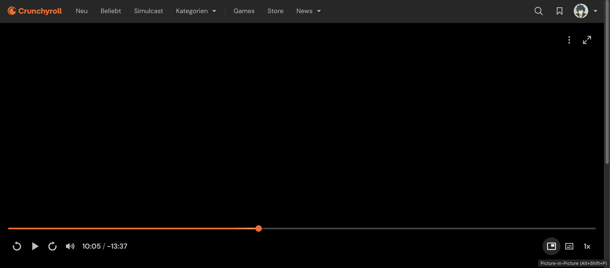

<h1>
  Crunchyroll PiP Extension
  
</h1>

This browser extension adds a **Picture-in-Picture (PiP)** button directly to the Crunchyroll player controls.

The button appears only:
- on episode pages (`/watch/...`)
- after playback has started

## Features

- PiP button inside the right-side player controls
- Position: directly left of the subtitle/track button
- Keyboard shortcut:
  - **macOS:** `Option + Shift + P`
  - **Windows/Linux:** `Alt + Shift + P`

## Installation (Brave / Chrome)

1. Download or clone this repository.
2. Open `brave://extensions` or `chrome://extensions`.
3. Enable **Developer mode** (top-right).
4. Click **Load unpacked**.
5. Select this repository folder.

Done.

## Install from GitHub Release (ZIP)

1. Open the repository's **Releases** page on GitHub.
2. Download `crunchyroll-pip-extension-vX.Y.Z.zip` from release assets.
3. Extract the ZIP.
4. Open `brave://extensions` (or `chrome://extensions`).
5. Enable **Developer mode**.
6. Click **Load unpacked** and select the extracted folder.

## Usage

1. Open a Crunchyroll episode.
2. Start the video.
3. Click the PiP button in the player controls, or use the keyboard shortcut.

## Updating after changes

1. Open `brave://extensions`.
2. Click **Reload** on the extension card.
3. Refresh your Crunchyroll tab.

## Note

If PiP does not start for a specific stream, this is usually caused by browser/DRM limitations in the player.

## License

This project is licensed under the MIT License. See the [LICENSE](LICENSE) file for details.
