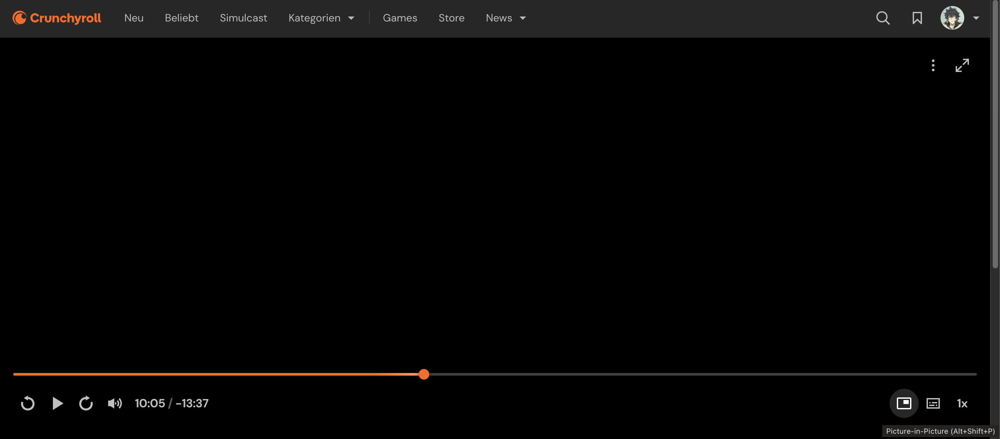

<h1>
  Crunchyroll PiP Extension
  <a href="https://github.com/mlemors/crunchyroll-pip-extension/releases/latest">
    
  </a>
</h1>

This browser extension adds a **Picture-in-Picture (PiP)** button directly to the Crunchyroll player controls.



The button appears only:
- on episode pages (`/watch/...`)
- after playback has started

## Features

- PiP button inside the right-side player controls
- Position: directly left of the subtitle/track button
- Keyboard shortcut:
  - **macOS:** `Option + Shift + P`
  - **Windows/Linux:** `Alt + Shift + P`

## Browser compatibility

- Supported: Chromium-based browsers (Brave, Google Chrome, Microsoft Edge, Vivaldi, Opera)
- Not officially supported: Firefox and Safari

The extension uses Chromium extension APIs. The WebKit PiP fallback in the video code does not make the extension itself Safari-compatible.

## Installation from a GitHub release

1. Open the repository's [Releases](https://github.com/mlemors/crunchyroll-pip-extension/releases) page.
2. Download the ZIP from the latest release.
3. Extract the ZIP to a permanent folder.
4. Open `chrome://extensions`.
5. Enable **Developer mode** (top-right).
6. Click **Load unpacked** and select the extracted folder.

Keep the extracted folder in place; the browser loads the extension directly from it.

## Installation from source

1. Download or clone this repository.
2. Open `chrome://extensions`.
3. Enable **Developer mode** (top-right).
4. Click **Load unpacked**.
5. Select this repository folder.

## Usage

1. Open a Crunchyroll episode.
2. Start the video.
3. Click the PiP button in the player controls, or use the keyboard shortcut.

## Updating after changes

1. Open `chrome://extensions`.
2. Click **Reload** on the extension card.
3. Refresh your Crunchyroll tab.

## Troubleshooting

- The button appears only on episode pages (`/watch/...`) after playback has started.
- If the button is missing after an update, reload the extension and refresh the Crunchyroll tab.
- If PiP does not start for a specific stream, browser or DRM limitations in the player are the most likely cause.

## Development

Run the regression tests with Node.js 22 or newer (no package installation needed):

```sh
node --test tests/*.test.cjs
```

To build a release ZIP, run:

```sh
./scripts/build-release-zip.sh
```

The ZIP is written to `dist/`. Its version is read from `manifest.json`.

## Changes in 1.0.3

- Add an orange PiP icon for the toolbar and extension management page.
- Bundle PNG icons at 16, 32, 48, and 128 pixels in the release ZIP.
- Rebuild icons with `python3 scripts/build-icons.py` (no dependencies required).

## Changes in 1.0.2

- Handle the keyboard shortcut only through the browser command to avoid duplicate toggles.
- Close an existing PiP window even when the selected video changes.
- Prefer loaded videos over unloaded placeholders; fix WebKit fallback toggling.
- Locate the subtitle button within the player controls without depending on a CSS framework class.
- Batch DOM refreshes, bind replacement videos, and retain SPA navigation polling.
- Add accessible status messages and ten regression tests.

The regression suite uses simulated browser APIs and DOM fixtures. Playback on the live
Crunchyroll site, DRM behavior, and browser shortcut dispatch require a separate browser check.

## License

This project is licensed under the MIT License. See the [LICENSE](LICENSE) file for details.
